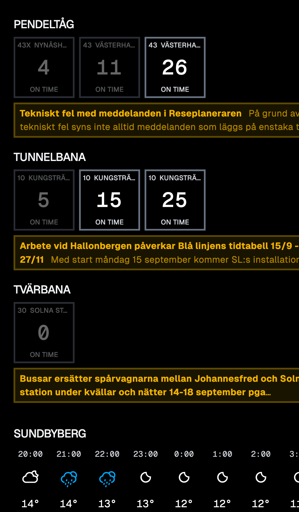

# Raspberry Display

A project to have a always up-to-date display of SL departure times as well as SMHI weather next to my door.

**Screenshot:**


## Hardware

- this project runs on a [Raspberry Pi Zero W2](https://www.raspberrypi.com/products/raspberry-pi-zero-2-w/)
- using the [Waveshare 7″ Touch Display Kit For Raspberry Pi Zero](https://www.waveshare.com/product/raspberry-pi/boards-kits/raspberry-pi-zero/zero-disp-7a.htm) as a display
- with a [custom 3D printed frame for the display from printables.com](https://www.printables.com/model/798912-waveshare-7inch-display-for-rpirpi-zero-enclosure/files)
- and since I don't own a 3D printer, I ordered the print at [rapidprototypingsolutions.se](https://rapidprototypingsolutions.se/)

## The software

### Install the prerequisites

1. Install nodeJS v22 or newer. The best way on a raspberry pi is to use nvm.
2. This project uses pnpm to manage dependencies. Install it with `npm i -g pnpm`
3. install all dependencies with `pnpm i`

### Configuring the content on the display

Open the file `apps/api/src/config.ts` in a text editor. For example `nano apps/api/src/config.ts`.

### Preparing to run the display

This only needs to be executed once after each `git pull` or when this project is installed for the first time: `pnpm build`

Check if everything works by running `pnpm start`. Once the display is showing what you expect, you can exit using CTRL+C

### set up auto start

1. We're using pm2 as a process manager for this: `npm i -g pm2`
2. Make pm2 start the project `pm2 start "pnpm start"`
3. Save the pm2 configuration `pm2 save`
4. Set up pm2 to be started on system start. For this, check the docs here: https://pm2.keymetrics.io/docs/usage/startup/

### optional: set up scheduled display blanking or display rotation

I'm using a custom start script `startRasperryDisplay.sh` that runs the display rotation script and then starts the display:

```bash
cd ./raspberry-display
./scripts/screen-rotate.sh
pnpm start
```

this custom script is then started using pm2: `pm2 start startRasperryDisplay.sh`

I'll then configure my crontab to look like this: `crontab -e`

```crontab
CRON_TZ=Europe/Stockholm

# Start in the morning:
30 6 * * * /home/raspberry/.nvm/versions/node/v22.16.0/bin/pm2 start startRasperryDisplay
0 7 * * * ~/raspberry-display/scripts/keep-screen-on.sh

# allow screen blanking after the morning
30 8 * * * ~/raspberry-display/scripts/allow-screen-blanking.sh

# put everything to sleep in the evening
0 21 * * * /home/raspberry/.nvm/versions/node/v22.16.0/bin/pm2 stop startRasperryDisplay
1 21 * * * ~/raspberry-display/scripts/force-screen-off.sh
```

Hint: Check the path to pm2 using `which pm2`. Depending on the node version you might need to adjust the path
